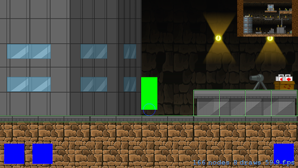
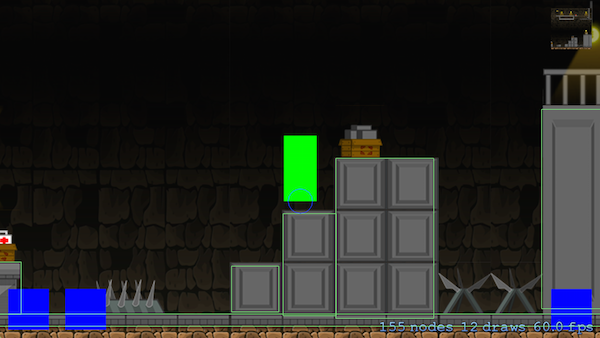

#SKAToolKit
SKAToolKit is a free set of tools created by the Sprite Kit Alliance to be used with Apples Sprite Kit framework. One of the biggest features is the SKATiledMap which is a simple solution for creating a map using the free Tiled Map Editor http://www.mapeditor.org/. 

The Sprite Kit Alliance is happy to provide the SKAToolKit free of charge without any warranty or guarantee (see license below for more info). If there is a feature missing or you would like added please email Skyler at skyler@skymistdevelopment.com.

##SKAToolKit Install Instructions
- Copy all files in SKAToolKit folder into your project
- Import either SKATiledMap or any SKA file you want
- Link to `libz.dylib` in the “Linked Frameworks and Libraries” section of your project file

##SKATiledMap
This is a sprite node that represents a map created in Tiled. Currently SKATiledMap only supports JSON format. Add the JSON file and any images used for your tiles into your project.

###Resolution Support
It is important that you make your map in Tiled using 1x assets. When you are ready to bring it into your app for best results provide 1x, @2x, and @3x assets. Keep in mind that there limitation with SpriteKit and texture sizes. Make sure your 1x assets do not exceed 675 x 675 (when at 3x they would be 2025 under the 2048 limit). Just like tiled you only need to import the images used to create your map. Put these images into an asset catalog for best results. No plist files or reference folders needed.

###Supported Map Types
Currently SKATileMap supports Tiled Maps that are exported in the JSON format (TMX coming soon). In Tiled export your map as a JSON file and import it into your app. Make sure you locate all images you used for your map and import those along with any @2x and @3x version of those images. You can put these images into an asset catalog for best results.	 There is no need to create atlas reference folders or add plists. Tiled and SKATiledMap do not use them.

To create a map it is a simple matter of calling this method.

    SKATiledMap *map = [[SKATiledMap alloc]initWithMapName:@"yourMapName"]; //name of your JSON file
    
###Useful Methods
	//Use this to convert a map CGPoint on your map into an x y index on your map. This can be useful for looking at tiles around a player or doing manual collision detection.
    -(CGPoint)indexForPoint:(CGPoint)point;

    //This methods will return SKASprites around a given point or index on the map.
    -(NSArray *)tilesAroundPoint:(CGPoint)point inLayer:(NSInteger)layer;
    -(NSArray *)tilesAroundIndex:(CGPoint)point inLayer:(NSInteger)layer;

	//This method can be used to to get a specific tile on a specific layer
    -(SKASprite *)spriteOnLayer:(NSInteger)layerNumber indexX:(NSInteger)x indexY:(NSInteger)y;

	//This method is used to get custom named objects that you may have made in Tiled for spawning enemies, player start positions, or any other custom game logic you made a object for.
    -(NSArray *)objectsOnLayer:(NSInteger)layerNumber withName:(NSString *)name;
    
    
###Using Layers
All layers are available. To do cool things with. For example you can take a layer and add a blinking effect for light sprites you may have.

    SKAction *fadeOut = [SKAction fadeAlphaTo:0 duration:.5];
    SKAction *fadeIn = [SKAction fadeAlphaTo:1 duration:.5];
    
    SKAction *repeat = [SKAction repeatActionForever:[SKAction sequence:@[fadeOut, fadeIn]]];
    
    SKASpriteLayer *layer =  self.map.spriteLayers[2];
    
    [layer runAction:repeat];

###SKATiledMap Auto Follow Feature
The SKATiledMap has an auto follow feature. This is a great feature if you want the map to position itself and keep a player on screen. To use this feature set the autoFollowNode to any subclass of SKNode and call the maps update method in the scene update method. 

    self.player = [SKATestPlayer spriteNodeWithColor:[SKColor greenColor] size:CGSizeMake(40, 80)];
    self.player.zPosition = 20;
    self.player.position = CGPointMake(400, 400);
    [self.map addChild:self.player];
    
    self.map.autoFollowNode = self.player;
    
    -(void)update:(NSTimeInterval)currentTime
    {
        [self.map update];
    }

###Auto Collision Generation
When creating your Tiled map SKATiledMap will create physical bodies if it finds these properties on a tile or object.

- SKACollisionType : SKACollisionTypeRect

###ZPosition and Optimization
SKATiledMap is optimized for `ignoresSiblingOrder`. Make sure you set your SKView to `skView.ignoresSiblingOrder = YES;` The zPosition is as follows. Layer one tiles will be at zPosition 0 and layer two will be at zPosition 1. SKATiledMap also maximizes draw calls. You will only have as many draw calls as you have sprite maps.

##SKATestHud and SKATestPlayer
The SKATestHud and SKATestPlayer are used to quickly test a map without having to create any custom code. SKATestHud default zPosition is 100.

Example

    self.player = [SKATestPlayer spriteNodeWithColor:[SKColor greenColor] size:CGSizeMake(40, 80)];
    self.player.zPosition = 20;
    self.player.position = CGPointMake(400, 400);
    [self.map addChild:self.player];
    
    SKATestHud *testHud = [SKATestHud hudWithScene:self.scene withPlayer:self.player];
    
    [self addChild:testHud];

##SKAButtonSprite
SKAButtonSprite is a simple sprite button. It can be created using any SKSpriteNode inits or convince methods. IMPORTANT you must set userInteractionEnabled = YES;

Optional Delegate Methods

    -(void)buttonSpritePressed:(SKAButtonSprite *)buttonSprite;
    -(void)buttonSpriteDown:(SKAButtonSprite *)buttonSprite;
    -(void)buttonSpriteUp:(SKAButtonSprite *)buttonSprite;

Example 

    self.buttonLeft = [SKAButtonSprite spriteNodeWithColor:[UIColor blueColor] size:CGSizeMake(50, 50)];
    self.buttonLeft.position = CGPointMake(self.buttonLeft.size.width/2+padding, self.buttonLeft.size.height/2+padding);
    self.buttonLeft.name = @"buttonLeft";
    self.buttonLeft.userInteractionEnabled = YES;
    self.buttonLeft.delegate = self;
    [self addChild:self.buttonLeft];
    
##SKAMiniMap
SKAMiniMap creates a mini map of any node that you pass in. The node you pass in must be part of a scene with a view

##SKACroppedMiniMap
SKACroppedMiniMap is similar to SKAMiniMap, but instead of seeing the entire map at once you can choice a viewport size.

###SKACroppedMiniMap AutoFollowFeature
SKACroppedMiniMap has an auto follow feature. Set the autoFollowNode to a node that is a child of the map used to create the SKACroppedMiniMap.

    
###Contact Info
If you would like to get in contact with the SKA email Skyler at skyler@skymistdevelopment.com
    
###License
Copyright (c) 2015 Sprite Kit Alliance

Permission is hereby granted, free of charge, to any person obtaining a copy of this software and associated documentation files (the "Software"), to deal in the Software without restriction, including without limitation the rights to use, copy, modify, merge, publish, distribute, sublicense, and/or sell copies of the Software, and to permit persons to whom the Software is furnished to do so, subject to the following conditions:

The above copyright notice and this permission notice shall be included in all copies or substantial portions of the Software.

THE SOFTWARE IS PROVIDED "AS IS", WITHOUT WARRANTY OF ANY KIND, EXPRESS OR IMPLIED, INCLUDING BUT NOT LIMITED TO THE WARRANTIES OF MERCHANTABILITY, FITNESS FOR A PARTICULAR PURPOSE AND NONINFRINGEMENT. IN NO EVENT SHALL THE AUTHORS OR COPYRIGHT HOLDERS BE LIABLE FOR ANY CLAIM, DAMAGES OR OTHER LIABILITY, WHETHER IN AN ACTION OF CONTRACT, TORT OR OTHERWISE, ARISING FROM, OUT OF OR IN CONNECTION WITH THE SOFTWARE OR THE USE OR OTHER DEALINGS IN THE SOFTWARE.

